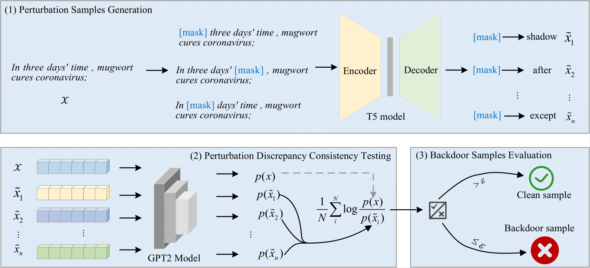

# NETE: Backdoor Samples Detection Based on Perturbation Discrepancy Consistency in Pre-trained Language Models

<div align="center">

[](https://doi.org/10.1016/j.neunet.2025.108025)
[](https://arxiv.org/abs/2509.05318)
[](LICENSE)
[](https://python.org)

**Implementation**

*Backdoor Samples Detection Based on Perturbation Discrepancy Consistency in Pre-trained Language Models*

**Published in Neural Networks (2026)**

</div>

---

## 📖 Abstract

This repository contains the implementation of **NETE** (perturbatio**N** discr**E**pancy consis**T**ency **E**valuation), a novel approach for detecting backdoor samples in pre-trained language models through perturbation discrepancy consistency analysis. Our method achieves state-of-the-art performance across multiple backdoor attack scenarios and datasets.

<div align="center">

<br>
<em>Figure 1: Overview of the NETE detection framework</em>
</div>

---

## 🚀 Quick Start

### Environment Setup

```bash
# Create and activate conda environment
conda create -n backdoor-detect-nete python=3.7
conda activate backdoor-detect-nete

# Install dependencies
pip install -r requirements.txt

# Clone repository
git clone https://github.com/pzq7025/BackdoorDetection.git
cd BackdoorDetection

# Run quick demo
bash xxx.sh
```

---

## 📊 Datasets

### Primary Evaluation Datasets

| Dataset | Domain | Description | Source |
|---------|---------|-------------|---------|
| **Yelp** | Sentiment Analysis | Restaurant reviews dataset | [Link](https://www.yelp.com/dataset) |
| **OLID** | Offensive Language | Offensive language identification | [Link](https://sites.google.com/site/offensevalsharedtask/) |
| **COVID** | Social Media | COVID-19 related tweets | [Link](https://github.com/thepanacealab/covid19_twitter) |

> **Note**: All primary datasets are located in the `datasets_experiment` directory. Style transfer augmentation is performed using [STRAP](https://github.com/martiansideofthemoon/style-transfer-paraphrase).

### Attack Scenarios & Datasets

| Attack Type | Dataset Name | Framework | Reference |
|-------------|--------------|-----------|-----------|
| **Word-level** | Various | [OpenBackdoor](https://github.com/thunlp/OpenBackdoor) | Standard word triggers |
| **Sentence-level** | Various | [OpenBackdoor](https://github.com/thunlp/OpenBackdoor) | Sentence patterns |
| **Syntactic-level** | Various | [OpenBackdoor](https://github.com/thunlp/OpenBackdoor) | Grammar structures |
| **BadChain** | `badchain_datasets` | Custom | [Repo](https://github.com/Django-Jiang/BadChain) |
| **BadEdit** | `badedit_datasets` | Custom | [Repo](https://github.com/Lyz1213/BadEdit) |
| **CBA** | `CBADatasets` | Custom | [Repo](https://github.com/MiracleHH/CBA) |
| **Sleeper Agent** | `sleepagent_dataset` | Custom | [Repo](https://github.com/hsouri/Sleeper-Agent) |
| **VPI** | `VPIDatasets` | Custom | [Repo](https://github.com/wegodev2/virtual-prompt-injection) |
| **Multi-level** | `multi_level_trigger` | Custom | Combined triggers |

### Adversarial Evaluation

Adversarial samples are generated using [TextAttack](https://github.com/QData/TextAttack) to evaluate robustness against natural perturbations.

---

## 🧪 Experiments

### Core Evaluation

#### Primary Results
```bash
# Style-based backdoor detection
bash main_result.sh

# Multi-level backdoor evaluation (Word/Sentence/Syntactic)
bash patch_backdoor.sh
```

#### Ablation Studies
```bash
# Impact of different masking models
bash different_mask_model_experiments.sh

# Comparison across pre-trained model architectures
bash different_pretrained_model_experiments.sh
```

### Advanced Attack Scenarios

```bash
# BadChain attacks (multiple trigger variants)
bash badchain_new_trigger_result.sh
bash badchain_result.sh

# BadEdit attacks
bash Badedit_result.sh

# Virtual Prompt Injection (VPI)
bash VPI_result.sh

# Sleeper Agent attacks
bash sleepagent_result.sh

# Clean-label backdoor attacks (CBA)
bash CBA_result.sh

# Multi-trigger scenarios
bash multi_trigger_result.sh
```

---

## 🔧 Custom Dataset Integration

To evaluate NETE on your own datasets, use the provided template:

### Directory Structure
```
your_project/
├── custom_dataset_name/
│   └── backdoor_metadata.csv
└── custom_run.sh
```

### Template Script (`custom_run.sh`)
```bash
#!/bin/bash

# GPU configuration
cuda=0

# NETE detection execution
CUDA_VISIBLE_DEVICES=$cuda python main_detect.py \
    --file_name backdoor_metadata \
    --pct_words_masked 0.7 \
    --random_fills \
    --random_fills_tokens \
    --dataset_path custom_dataset_name \
    --n_perturbation_list 1,3,5,10,50,100,200
```

> **Important**: Ensure that backdoor samples occupy the first half of your dataset, with benign samples in the second half.

---

## 🔗 Related Work

For comprehensive backdoor attacks in large language models, see [BackdoorLLM](https://github.com/bboylyg/BackdoorLLM).

---

## 📝 Citation

If you find our work useful in your research, please consider citing:

```bibtex
@article{peng2026nete,
  title={Backdoor Samples Detection Based on Perturbation Discrepancy Consistency in Pre-trained Language Models},
  author={Peng, Zuquan and Fu, Jianming and Zou, Lixin and Zheng, Li and Ren, Yanzhen and Peng, Guojun},
  journal={Neural Networks},
  volume={193},
  pages={108025},
  year={2026},
  publisher={Elsevier},
  doi={10.1016/j.neunet.2025.108025}
}
```

---

## 🙏 Acknowledgments

This work builds upon the foundational codebase from [detect-gpt](https://github.com/eric-mitchell/detect-gpt). We thank the authors for their valuable contributions to the field.

---

## 📄 License

This project is licensed under the Apache2.0 License - see the [LICENSE](LICENSE) file for details.

---

<div align="center">

**[Paper](https://doi.org/10.1016/j.neunet.2025.108025)** | **[arXiv](https://arxiv.org/abs/2509.05318)** | **[Code](https://github.com/pzq7025/BackdoorDetection)**
</div>